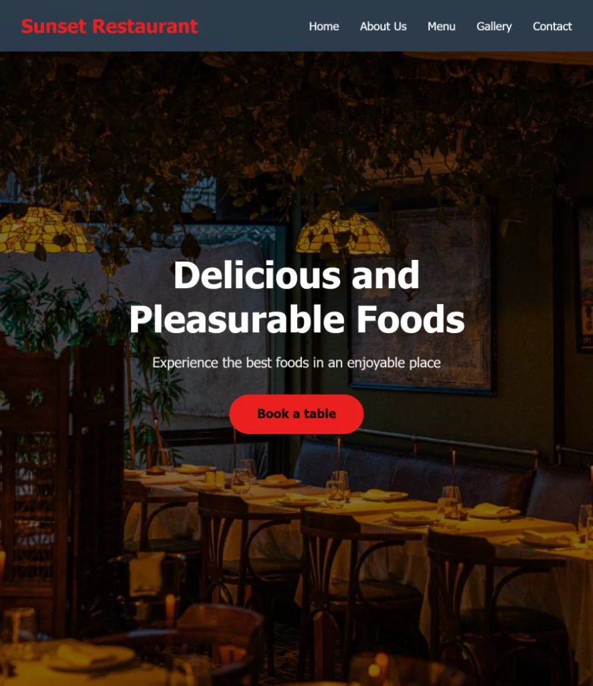
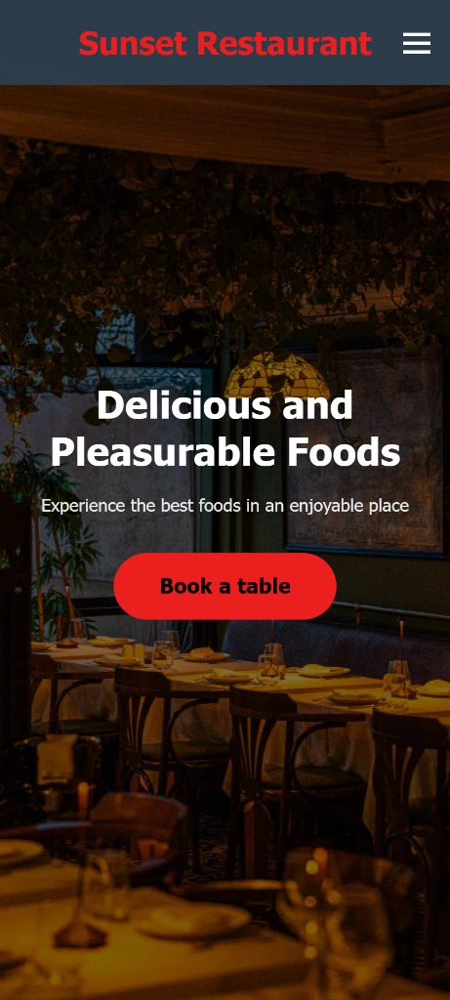

# 🍽 Sunrise Restaurant Website

A fully responsive, beautiful landing page.
Built with semantic HTML, modern CSS, and modular Ordinary JavaScript.

## 🚀 Live Demo

[View Live](https://mahdihassani1408-rgb.github.io/Restaurant-Website)

## ✨ Features

- Hero section with call-to-action
- About section with restaurant story
- Food menu with grid layout
- Photo gallery with hover effects
- Contact form with client-side validation
- Animated hamburger menu for mobile
- Back-to-top button
- Smooth scrolling between sections
- Fully responsive (mobile, tablet, desktop)

## 🛠 Tech Stack

- HTML5 (Semantic & Accessible)
- CSS3 (Flexbox, Grid, Custom Properties, Animations, Media Queries)
- JavaScript (ES6 Modules)
- No frameworks — pure ordinary code

## 📸 Screenshots

| Desktop | Mobile |
|---------|--------|
|  |  |

## 📂 Project Structure

Reastaurant-Website/
|—— index.hml
|—— css/
| ⨽—— style.css
|—— js/
| ⊢—— main.js
| ⨽—— modules/
| ⊢—— navbar.js
| ⊢—— formHandler.js
| ⨽—— backToTop.js
| ⊢—— assets/
| ⨽—— images/
|—— screenshots/
⨽—— README.md

## 🏁 Getting Started

1. Clone the repository:
   ```bash
   git clone https://github.com/mahdihassani1408-rgb/Restaurant-Website.git
2. Open index.html with Live Server.
⚠ ES Modules require HTTP protocol. Do not open via file://.